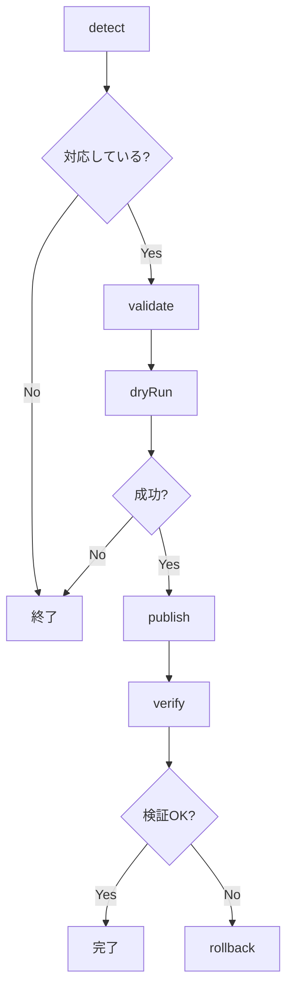

# Plugin Development Guide

package-publisherのカスタムレジストリプラグインを開発するためのガイドです。

## 📋 目次

- [概要](#概要)
- [プラグインの種類](#プラグインの種類)
- [RegistryPlugin（ビルトインプラグイン）](#registrypluginビルトインプラグイン)
  - [プラグインアーキテクチャ](#プラグインアーキテクチャ)
  - [RegistryPluginインターフェース](#registrypluginインターフェース)
  - [実装ガイド](#実装ガイド)
  - [テスト](#テスト)
  - [サンプルプラグイン](#サンプルプラグイン)
  - [ベストプラクティス](#ベストプラクティス)
- [PublishPlugin（外部プラグイン）](#publishplugin外部プラグイン)
  - [クイックスタート](#クイックスタート)
  - [PublishPluginインターフェース](#publishpluginインターフェース)
  - [設定とロード](#設定とロード)
  - [実装例](#実装例)
  - [テストとデバッグ](#テストとデバッグ)

## 概要

package-publisherは、2種類のプラグインシステムを提供しています：

1. **RegistryPlugin（ビルトインプラグイン）**: package-publisher本体に統合されるプラグイン
2. **PublishPlugin（外部プラグイン）**: npm パッケージまたはローカルファイルとして動的にロードされるプラグイン

## プラグインの種類

### RegistryPlugin（ビルトインプラグイン）

package-publisher本体に統合されるプラグインで、フルフィーチャーの実装が可能です。

**特徴:**
- ✅ package-publisherのソースコードに含まれる
- ✅ フルアクセス: すべての内部API、セキュリティ機能を利用可能
- ✅ 完全な統合: 検証、Dry-run、公開、検証、ロールバックのフルライフサイクル
- ✅ テスト: package-publisherのテストスイートに含まれる
- ❌ ユーザーが動的に追加できない

**使用例:**
- NPMPlugin, PyPIPlugin, CratesIOPlugin, HomebrewPlugin（すべて標準装備）

### PublishPlugin（外部プラグイン）

外部パッケージとして配布され、動的にロードされるプラグインです。

**特徴:**
- ✅ 動的ロード: npm パッケージまたはローカルファイルから読み込み
- ✅ 独立配布: 独自のnpmパッケージとして公開可能
- ✅ シンプルなAPI: 公開に必要な最小限のインターフェース
- ✅ プロジェクト固有の設定: `.publish-config.yaml` で設定
- ❌ 内部APIへのアクセス制限あり

**使用例:**
- 企業内プライベートレジストリ
- カスタムパッケージマネージャー
- 特殊なレジストリ（社内システム等）

---

# RegistryPlugin（ビルトインプラグイン）

package-publisher本体に統合されるプラグインの開発ガイドです。

### プラグインの責務

1. **検出**: プロジェクトが対象レジストリに対応しているか判定
2. **検証**: パッケージメタデータ、テスト、Lintの実行
3. **Dry-run**: 公開のシミュレーション
4. **公開**: 実際のパッケージ公開
5. **検証**: 公開後の確認
6. **ロールバック**: 公開の取り消し（オプション）

### 既存プラグイン

参考実装として以下のプラグインが利用可能：

- `NPMPlugin`: npm/npmjs.com
- `CratesIOPlugin`: Rust/crates.io
- `PyPIPlugin`: Python/PyPI
- `HomebrewPlugin`: Homebrew

## プラグインアーキテクチャ

### 全体構成

```
package-publisher/
├── src/
│   ├── core/
│   │   ├── interfaces.ts       # RegistryPlugin interface
│   │   ├── PackagePublisher.ts # Orchestrator
│   │   └── ...
│   ├── plugins/
│   │   ├── NPMPlugin.ts        # npm実装
│   │   ├── CratesIOPlugin.ts   # crates.io実装
│   │   └── YourPlugin.ts       # あなたのプラグイン
│   └── security/
│       ├── SafeCommandExecutor.ts
│       └── ...
└── tests/
    └── unit/
        └── YourPlugin.test.ts
```

### ライフサイクル



## RegistryPluginインターフェース

すべてのプラグインは`RegistryPlugin`インターフェースを実装する必要があります。

### 完全な型定義

```typescript
export interface RegistryPlugin {
  // 識別情報
  readonly name: string
  readonly version: string

  // 必須メソッド
  detect(projectPath: string): Promise<boolean>
  validate(): Promise<ValidationResult>
  dryRun(): Promise<DryRunResult>
  publish(options?: PublishOptions): Promise<PublishResult>
  verify(): Promise<VerificationResult>

  // オプショナルメソッド
  rollback?(version: string): Promise<RollbackResult>
}
```

### 各メソッドの詳細

#### `detect(projectPath: string): Promise<boolean>`

プロジェクトが対象レジストリに対応しているか判定します。

**パラメータ**:
- `projectPath`: プロジェクトルートディレクトリの絶対パス

**戻り値**:
- `true`: 対応している
- `false`: 対応していない

**実装例**:
```typescript
async detect(projectPath: string): Promise<boolean> {
  try {
    // package.jsonの存在確認
    await fs.access(
      path.join(projectPath, 'package.json'),
      fs.constants.R_OK
    )
    return true
  } catch {
    return false
  }
}
```

#### `validate(): Promise<ValidationResult>`

パッケージメタデータとプロジェクトの検証を行います。

**戻り値**: `ValidationResult`
```typescript
interface ValidationResult {
  valid: boolean
  errors: ValidationError[]
  warnings: ValidationWarning[]
  metadata?: {
    packageName?: string
    version?: string
    [key: string]: any
  }
}
```

**実装ポイント**:
1. メタデータファイル（package.json等）の読み込み
2. 必須フィールドの検証
3. バージョン形式の検証
4. テスト実行（存在する場合）
5. Lint実行（存在する場合）

#### `dryRun(): Promise<DryRunResult>`

公開のシミュレーションを実行します。

**戻り値**: `DryRunResult`
```typescript
interface DryRunResult {
  success: boolean
  output: string
  estimatedSize?: string
  errors?: ValidationError[]
}
```

**実装例**:
```typescript
async dryRun(): Promise<DryRunResult> {
  try {
    const result = await this.executor.execSafe(
      'npm',
      ['publish', '--dry-run'],
      { cwd: this.projectPath }
    )
    return {
      success: true,
      output: result.stdout + result.stderr
    }
  } catch (error) {
    return {
      success: false,
      output: (error as Error).message,
      errors: [...]
    }
  }
}
```

#### `publish(options?: PublishOptions): Promise<PublishResult>`

実際のパッケージ公開を実行します。

**パラメータ**: `PublishOptions`
```typescript
interface PublishOptions {
  dryRun?: boolean
  nonInteractive?: boolean
  otp?: string         // 2FA OTP
  tag?: string         // dist-tag, feature flag
  access?: 'public' | 'restricted'
  resume?: boolean
  [key: string]: any   // Plugin-specific options
}
```

**戻り値**: `PublishResult`
```typescript
interface PublishResult {
  success: boolean
  version?: string
  packageUrl?: string
  output?: string
  error?: string
  metadata?: Record<string, any>
}
```

#### `verify(): Promise<VerificationResult>`

公開されたパッケージをレジストリAPIで検証します。

**戻り値**: `VerificationResult`
```typescript
interface VerificationResult {
  verified: boolean
  version?: string
  url?: string
  error?: string
  metadata?: Record<string, any>
}
```

**実装例**:
```typescript
async verify(): Promise<VerificationResult> {
  const packageName = this.packageJson!.name
  const expectedVersion = this.packageJson!.version

  const response = await fetch(
    `https://registry.npmjs.org/${packageName}`
  )

  if (!response.ok) {
    return {
      verified: false,
      error: `パッケージが見つかりません`
    }
  }

  const data = await response.json()
  if (!data.versions[expectedVersion]) {
    return {
      verified: false,
      error: `バージョン ${expectedVersion} が見つかりません`
    }
  }

  return {
    verified: true,
    version: expectedVersion,
    url: `https://www.npmjs.com/package/${packageName}`
  }
}
```

#### `rollback(version: string): Promise<RollbackResult>` (オプション)

公開されたバージョンをロールバックします。

**パラメータ**:
- `version`: ロールバック対象のバージョン

**戻り値**: `RollbackResult`
```typescript
interface RollbackResult {
  success: boolean
  message: string
  error?: string
}
```

**実装注意点**:
- レジストリがロールバックをサポートしていない場合は実装不要
- サポートしている場合も制限事項を明記（npmは72時間以内のみunpublish可能等）

## 実装ガイド

### ステップ1: プラグインクラスの作成

```typescript
// src/plugins/MyRegistryPlugin.ts
import {
  RegistryPlugin,
  ValidationResult,
  DryRunResult,
  PublishResult,
  VerificationResult,
  RollbackResult,
  ValidationError,
  ValidationWarning,
  PublishOptions
} from '../core/interfaces'
import { SafeCommandExecutor } from '../security/SafeCommandExecutor'
import { ErrorFactory } from '../core/ErrorHandling'
import { RetryManager } from '../core/RetryManager'
import * as fs from 'fs/promises'
import * as path from 'path'

// グローバルfetch (Node.js 18+)
declare const fetch: typeof globalThis.fetch

export class MyRegistryPlugin implements RegistryPlugin {
  readonly name = 'my-registry'
  readonly version = '1.0.0'

  private executor: SafeCommandExecutor
  private retryManager: RetryManager
  private metadataPath: string
  private metadata?: any

  constructor(
    private projectPath: string,
    executor?: SafeCommandExecutor
  ) {
    this.metadataPath = path.join(projectPath, 'metadata.json')
    this.executor = executor || new SafeCommandExecutor()
    this.retryManager = new RetryManager()
  }

  // 各メソッドを実装...
}
```

### ステップ2: detectメソッド実装

```typescript
async detect(projectPath: string): Promise<boolean> {
  try {
    // 検出ロジック: メタデータファイルの存在確認
    await fs.access(
      path.join(projectPath, 'metadata.json'),
      fs.constants.R_OK
    )
    return true
  } catch {
    return false
  }
}
```

### ステップ3: validateメソッド実装

```typescript
async validate(): Promise<ValidationResult> {
  const errors: ValidationError[] = []
  const warnings: ValidationWarning[] = []

  try {
    // 1. メタデータ読み込み
    const content = await fs.readFile(this.metadataPath, 'utf-8')
    this.metadata = JSON.parse(content)

    // 2. 必須フィールド検証
    if (!this.metadata.name) {
      errors.push({
        field: 'name',
        message: 'nameは必須です',
        severity: 'error'
      })
    }

    if (!this.metadata.version) {
      errors.push({
        field: 'version',
        message: 'versionは必須です',
        severity: 'error'
      })
    }

    // 3. バージョン形式検証
    if (this.metadata.version && !this.isValidVersion(this.metadata.version)) {
      errors.push({
        field: 'version',
        message: '無効なバージョン形式です',
        severity: 'error'
      })
    }

    // 4. テスト実行（オプション）
    try {
      await this.executor.execSafe('npm', ['test'], {
        cwd: this.projectPath
      })
    } catch (error) {
      errors.push({
        field: 'tests',
        message: `テスト失敗: ${(error as Error).message}`,
        severity: 'error'
      })
    }

    return {
      valid: errors.length === 0,
      errors,
      warnings,
      metadata: {
        packageName: this.metadata.name,
        version: this.metadata.version
      }
    }
  } catch (error) {
    throw ErrorFactory.create(
      'VALIDATION_FAILED',
      this.name,
      `検証に失敗: ${(error as Error).message}`
    )
  }
}

private isValidVersion(version: string): boolean {
  // SemVer検証ロジック
  const semverRegex = /^(0|[1-9]\d*)\.(0|[1-9]\d*)\.(0|[1-9]\d*)$/
  return semverRegex.test(version)
}
```

### ステップ4: その他メソッド実装

`dryRun`, `publish`, `verify`, `rollback`も同様のパターンで実装します。

### ステップ5: エクスポート

```typescript
// src/index.ts
export { MyRegistryPlugin } from './plugins/MyRegistryPlugin'
```

### ステップ6: 登録

```typescript
// src/cli.ts またはユーザーコード
import { MyRegistryPlugin } from './plugins/MyRegistryPlugin'

const publisher = new PackagePublisher(projectPath)
publisher.registerPlugin(new MyRegistryPlugin(projectPath))
```

## テスト

### テストファイルの作成

```typescript
// tests/unit/MyRegistryPlugin.test.ts
import { MyRegistryPlugin } from '../../src/plugins/MyRegistryPlugin'
import { SafeCommandExecutor } from '../../src/security/SafeCommandExecutor'
import * as fs from 'fs/promises'
import * as path from 'path'

jest.mock('../../src/security/SafeCommandExecutor')
jest.mock('fs/promises')

global.fetch = jest.fn() as jest.Mock

describe('MyRegistryPlugin', () => {
  let plugin: MyRegistryPlugin
  let mockExecutor: jest.Mocked<SafeCommandExecutor>
  const testProjectPath = '/test/project'

  beforeEach(() => {
    mockExecutor = new SafeCommandExecutor() as jest.Mocked<SafeCommandExecutor>
    plugin = new MyRegistryPlugin(testProjectPath, mockExecutor)
    jest.clearAllMocks()
  })

  describe('detect', () => {
    it('metadata.jsonが存在する場合はtrueを返す', async () => {
      (fs.access as jest.Mock).mockResolvedValue(undefined)

      const result = await plugin.detect(testProjectPath)

      expect(result).toBe(true)
    })

    it('metadata.jsonが存在しない場合はfalseを返す', async () => {
      (fs.access as jest.Mock).mockRejectedValue(new Error('ENOENT'))

      const result = await plugin.detect(testProjectPath)

      expect(result).toBe(false)
    })
  })

  describe('validate', () => {
    it('有効なメタデータの場合は検証成功', async () => {
      const validMetadata = {
        name: 'my-package',
        version: '1.0.0'
      }

      (fs.readFile as jest.Mock).mockResolvedValue(
        JSON.stringify(validMetadata)
      )

      mockExecutor.execSafe.mockResolvedValue({
        stdout: '',
        stderr: '',
        exitCode: 0
      })

      const result = await plugin.validate()

      expect(result.valid).toBe(true)
      expect(result.errors).toHaveLength(0)
    })

    // その他のテストケース...
  })

  // publish, verify, rollbackのテスト...
})
```

### テストカバレッジ目標

- **Statement Coverage**: 80%以上
- **Branch Coverage**: 80%以上
- **Function Coverage**: 80%以上

```bash
# カバレッジレポート生成
npm run test:coverage
```

## サンプルプラグイン

最小限のプラグイン実装例：

```typescript
import {
  RegistryPlugin,
  ValidationResult,
  DryRunResult,
  PublishResult,
  VerificationResult
} from '../core/interfaces'
import { SafeCommandExecutor } from '../security/SafeCommandExecutor'
import * as fs from 'fs/promises'
import * as path from 'path'

export class MinimalPlugin implements RegistryPlugin {
  readonly name = 'minimal'
  readonly version = '1.0.0'

  constructor(
    private projectPath: string,
    private executor = new SafeCommandExecutor()
  ) {}

  async detect(projectPath: string): Promise<boolean> {
    try {
      await fs.access(path.join(projectPath, 'metadata.json'))
      return true
    } catch {
      return false
    }
  }

  async validate(): Promise<ValidationResult> {
    return {
      valid: true,
      errors: [],
      warnings: []
    }
  }

  async dryRun(): Promise<DryRunResult> {
    return {
      success: true,
      output: 'Dry-run simulation successful'
    }
  }

  async publish(): Promise<PublishResult> {
    return {
      success: true,
      version: '1.0.0',
      packageUrl: 'https://example.com/package'
    }
  }

  async verify(): Promise<VerificationResult> {
    return {
      verified: true,
      version: '1.0.0',
      url: 'https://example.com/package'
    }
  }
}
```

## ベストプラクティス

### 1. エラーハンドリング

```typescript
// ✅ 良い例: 詳細なエラーメッセージ
try {
  await this.executor.execSafe('my-cli', ['publish'], {
    cwd: this.projectPath
  })
} catch (error) {
  throw ErrorFactory.create(
    'PUBLISH_FAILED',
    this.name,
    `公開に失敗しました: ${(error as Error).message}。` +
    `ネットワーク接続とトークンを確認してください。`
  )
}

// ❌ 悪い例: エラーを隠蔽
try {
  await someOperation()
} catch {
  // 無視
}
```

### 2. リトライロジック

```typescript
// ✅ 良い例: RetryManagerを使用
const result = await this.retryManager.retry(
  async () => {
    return await this.executor.execSafe('publish-command', args)
  },
  {
    maxAttempts: 3,
    onRetry: async (attempt, error) => {
      console.log(`Retry ${attempt}/3: ${error.message}`)
    }
  }
)
```

### 3. 認証トークン管理

```typescript
// ✅ 良い例: 環境変数から取得
const token = process.env.MY_REGISTRY_TOKEN
if (!token) {
  throw ErrorFactory.create(
    'TOKEN_MISSING',
    this.name,
    'MY_REGISTRY_TOKEN環境変数を設定してください'
  )
}

// ❌ 悪い例: ハードコード
const token = 'abc123...'
```

### 4. バージョン検証

```typescript
// ✅ 良い例: 厳密な検証
private isValidVersion(version: string): boolean {
  // レジストリ固有のバージョン形式を検証
  const semverRegex = /^(0|[1-9]\d*)\.(0|[1-9]\d*)\.(0|[1-9]\d*)$/
  return semverRegex.test(version)
}
```

### 5. Dry-runの活用

```typescript
// ✅ 良い例: Dry-runで本番コマンドと同じ検証
async dryRun(): Promise<DryRunResult> {
  // 本番と同じコマンド（--dry-runフラグ付き）
  const result = await this.executor.execSafe(
    'publish-command',
    ['--dry-run'],
    { cwd: this.projectPath }
  )
  return {
    success: true,
    output: result.stdout
  }
}
```

### 6. メタデータのキャッシング

```typescript
// ✅ 良い例: 一度読み込んだメタデータをキャッシュ
private async loadMetadata(): Promise<void> {
  if (this.metadata) {
    return // Already loaded
  }

  const content = await fs.readFile(this.metadataPath, 'utf-8')
  this.metadata = JSON.parse(content)
}
```

### 7. 型安全性

```typescript
// ✅ 良い例: 型定義を明示
interface MyMetadata {
  name: string
  version: string
  description?: string
}

private metadata?: MyMetadata

// ❌ 悪い例: any型の多用
private metadata?: any
```

### 8. ドキュメント

```typescript
/**
 * Validates package metadata and runs tests
 *
 * @returns ValidationResult with errors and warnings
 * @throws PublishError if metadata file cannot be read
 */
async validate(): Promise<ValidationResult> {
  // Implementation...
}
```

## チェックリスト

プラグイン実装完了前に以下を確認：

- [ ] `RegistryPlugin`インターフェース完全実装
- [ ] `detect`メソッドが正確に動作
- [ ] `validate`で必須フィールドを検証
- [ ] バージョン形式の検証
- [ ] エラーハンドリングの実装
- [ ] テストカバレッジ80%以上
- [ ] エラーメッセージが明確
- [ ] 環境変数でトークン管理
- [ ] Dry-run動作確認
- [ ] ドキュメントコメント記載

## 参考リソース

- [NPMPlugin実装](../src/plugins/NPMPlugin.ts) - 最も完成度の高い実装
- [CratesIOPlugin実装](../src/plugins/CratesIOPlugin.ts) - TOML解析の例
- [PyPIPlugin実装](../src/plugins/PyPIPlugin.ts) - 複数メタデータ形式対応の例
- [HomebrewPlugin実装](../src/plugins/HomebrewPlugin.ts) - Git統合の例

## サポート

質問や問題がある場合：

- **Issues**: https://github.com/sanae-abe/package-publisher/issues
- **Discussions**: https://github.com/sanae-abe/package-publisher/discussions

---

# PublishPlugin（外部プラグイン）

外部パッケージとして配布され、動的にロードされるプラグインの開発ガイドです。

## クイックスタート

### 1. プロジェクト作成

```bash
mkdir my-registry-plugin
cd my-registry-plugin
npm init -y
```

### 2. 依存関係インストール

```bash
npm install --save-dev typescript @types/node
npm install --save-peer package-publisher
```

### 3. TypeScript設定

`tsconfig.json`:

```json
{
  "compilerOptions": {
    "target": "ES2022",
    "module": "ES2022",
    "moduleResolution": "node",
    "outDir": "./dist",
    "declaration": true,
    "strict": true,
    "esModuleInterop": true
  }
}
```

### 4. プラグイン実装

`src/index.ts`:

```typescript
import type {
  PublishPlugin,
  PluginInitConfig,
  PluginPublishOptions,
  PublishResult,
} from 'package-publisher'

class MyRegistryPlugin implements PublishPlugin {
  readonly name = 'myregistry'
  readonly version = '1.0.0'

  private apiKey?: string
  private apiUrl?: string

  async initialize(config: PluginInitConfig): Promise<void> {
    this.apiKey = config.pluginConfig.apiKey as string
    this.apiUrl = config.pluginConfig.apiUrl as string

    if (!this.apiKey) {
      throw new Error('API key is required')
    }
  }

  async supports(projectPath: string): Promise<boolean> {
    // プロジェクト検出ロジック
    try {
      const { access } = await import('fs/promises')
      await access(`${projectPath}/myregistry.json`)
      return true
    } catch {
      return false
    }
  }

  async publish(options: PluginPublishOptions): Promise<PublishResult> {
    const { packageName, version } = options.packageMetadata

    try {
      const response = await fetch(`${this.apiUrl}/publish`, {
        method: 'POST',
        headers: {
          'Authorization': `Bearer ${this.apiKey}`,
          'Content-Type': 'application/json',
        },
        body: JSON.stringify({ packageName, version }),
      })

      if (!response.ok) {
        return {
          success: false,
          error: `API error: ${response.status}`,
        }
      }

      return {
        success: true,
        version,
        packageUrl: `${this.apiUrl}/packages/${packageName}`,
      }
    } catch (error) {
      return {
        success: false,
        error: error instanceof Error ? error.message : 'Unknown error',
      }
    }
  }
}

export default new MyRegistryPlugin()
```

### 5. ビルドと使用

```bash
# ビルド
npx tsc

# 設定ファイルに追加 (.publish-config.yaml)
plugins:
  - name: ./path/to/my-registry-plugin/dist/index.js
    config:
      apiUrl: "https://api.myregistry.com"
      apiKey: "${MYREGISTRY_API_KEY}"
```

## PublishPluginインターフェース

### 必須プロパティ

#### `name: string`

プラグインの一意な識別子。レジストリ名と一致させることを推奨。

```typescript
readonly name = 'myregistry'
```

#### `version: string`

プラグインのセマンティックバージョン。

```typescript
readonly version = '1.0.0'
```

### 必須メソッド

#### `initialize(config: PluginInitConfig): Promise<void>`

プラグイン読み込み時に1回だけ呼ばれます。設定の検証、APIクライアントの初期化等を行います。

```typescript
interface PluginInitConfig {
  projectPath: string
  pluginConfig: Record<string, unknown>
  logger?: (message: string) => void
}
```

**実装例:**

```typescript
async initialize(config: PluginInitConfig): Promise<void> {
  this.logger = config.logger
  this.apiKey = config.pluginConfig.apiKey as string

  if (!this.apiKey) {
    throw new Error('Missing required config: apiKey')
  }

  this.logger?.('Plugin initialized successfully')
}
```

#### `supports(projectPath: string): Promise<boolean>`

プロジェクトがこのプラグインで処理可能か判定します。

**実装パターン:**

```typescript
// パターン1: 特定ファイルの存在確認
async supports(projectPath: string): Promise<boolean> {
  try {
    const { access } = await import('fs/promises')
    await access(`${projectPath}/myregistry.config.json`)
    return true
  } catch {
    return false
  }
}

// パターン2: package.json のフィールド確認
async supports(projectPath: string): Promise<boolean> {
  try {
    const pkg = await import(`${projectPath}/package.json`)
    return pkg.publishConfig?.registry === 'myregistry'
  } catch {
    return false
  }
}
```

#### `publish(options: PluginPublishOptions): Promise<PublishResult>`

パッケージを公開します。

```typescript
interface PluginPublishOptions {
  projectPath: string
  packageMetadata: PackageMetadata
  publishOptions?: PublishOptions
  pluginOptions?: Record<string, unknown>
}

interface PublishResult {
  success: boolean
  version?: string
  packageUrl?: string
  output?: string
  error?: string
  metadata?: Record<string, unknown>
}
```

**実装例:**

```typescript
async publish(options: PluginPublishOptions): Promise<PublishResult> {
  const { packageName, version } = options.packageMetadata

  try {
    // アップロードロジック
    await this.uploadPackage(packageName, version, options.projectPath)

    return {
      success: true,
      version,
      packageUrl: `https://myregistry.com/packages/${packageName}`,
      output: `Published ${packageName}@${version}`,
    }
  } catch (error) {
    return {
      success: false,
      error: error instanceof Error ? error.message : 'Unknown error',
    }
  }
}
```

### オプショナルメソッド

#### `verify(options: PluginVerifyOptions): Promise<VerificationResult>`

公開後の検証（推奨）。

```typescript
interface PluginVerifyOptions {
  projectPath: string
  packageName: string
  version: string
  expectedUrl?: string
  pluginOptions?: Record<string, unknown>
}

interface VerificationResult {
  verified: boolean
  version?: string
  url?: string
  error?: string
  metadata?: Record<string, unknown>
}
```

**実装例:**

```typescript
async verify(options: PluginVerifyOptions): Promise<VerificationResult> {
  const { packageName, version } = options

  const response = await fetch(
    `https://api.myregistry.com/packages/${packageName}/${version}`
  )

  return {
    verified: response.ok,
    version,
    url: `https://myregistry.com/packages/${packageName}`,
  }
}
```

## 設定とロード

### YAML設定ファイル

`.publish-config.yaml`:

```yaml
plugins:
  # npmパッケージとして配布
  - name: package-publisher-plugin-myregistry
    version: "^1.0.0"
    config:
      apiUrl: "https://api.myregistry.com"
      apiKey: "${MYREGISTRY_API_KEY}"  # 環境変数

  # ローカルパスから読み込み
  - name: ./plugins/custom-plugin.js
    config:
      endpoint: "http://localhost:3000"
      token: "${CUSTOM_TOKEN}"
```

### 環境変数の使用

機密情報は必ず環境変数で管理：

```bash
export MYREGISTRY_API_KEY="your-secret-key"
export CUSTOM_TOKEN="another-secret"
```

設定ファイルで `${変数名}` 形式で参照すると、自動的に展開されます。

### プラグインのロード

PluginLoader が自動的に：

1. 設定ファイルからプラグイン情報を読み込み
2. npm パッケージまたはローカルファイルから動的インポート
3. `initialize()` を呼び出して初期化
4. プラグインをキャッシュ

```typescript
// 内部的な動作（ユーザーは意識不要）
const loader = new PluginLoader(projectPath)
const plugins = await loader.loadPlugins(pluginConfigs)
```

## 実装例

完全なサンプルは [`examples/plugin-example/`](../examples/plugin-example/) を参照してください。

### シンプルな例

```typescript
import type {
  PublishPlugin,
  PluginInitConfig,
  PluginPublishOptions,
  PublishResult,
} from 'package-publisher'

class SimplePlugin implements PublishPlugin {
  readonly name = 'simple'
  readonly version = '1.0.0'

  async initialize(config: PluginInitConfig): Promise<void> {
    // 最小限の初期化
  }

  async supports(projectPath: string): Promise<boolean> {
    return true // すべてのプロジェクトをサポート
  }

  async publish(options: PluginPublishOptions): Promise<PublishResult> {
    // シミュレーション公開
    return {
      success: true,
      version: options.packageMetadata.version,
    }
  }
}

export default new SimplePlugin()
```

### エラーハンドリング付き

```typescript
class RobustPlugin implements PublishPlugin {
  readonly name = 'robust'
  readonly version = '1.0.0'

  private config?: Record<string, unknown>
  private logger?: (message: string) => void

  async initialize(config: PluginInitConfig): Promise<void> {
    this.logger = config.logger
    this.config = config.pluginConfig

    // 設定検証
    const requiredFields = ['apiUrl', 'apiKey']
    for (const field of requiredFields) {
      if (!this.config[field]) {
        throw new Error(`Missing required config: ${field}`)
      }
    }

    this.logger?.('Plugin initialized')
  }

  async supports(projectPath: string): Promise<boolean> {
    try {
      // 検出ロジック
      return true
    } catch (error) {
      this.logger?.(`Detection failed: ${error}`)
      return false
    }
  }

  async publish(options: PluginPublishOptions): Promise<PublishResult> {
    this.logger?.('Publishing...')

    try {
      // 公開ロジック
      return {
        success: true,
        version: options.packageMetadata.version,
      }
    } catch (error) {
      this.logger?.(`Publish failed: ${error}`)
      return {
        success: false,
        error: error instanceof Error ? error.message : 'Unknown error',
      }
    }
  }
}
```

## テストとデバッグ

### ユニットテスト

```typescript
import { describe, it, expect } from '@jest/globals'
import plugin from '../src/index'

describe('MyRegistryPlugin', () => {
  it('should initialize with valid config', async () => {
    await expect(
      plugin.initialize({
        projectPath: '/test',
        pluginConfig: {
          apiUrl: 'https://api.test.com',
          apiKey: 'test-key',
        },
      })
    ).resolves.not.toThrow()
  })

  it('should support projects with marker file', async () => {
    // モックファイルシステムでテスト
  })

  it('should publish successfully', async () => {
    const result = await plugin.publish({
      projectPath: '/test',
      packageMetadata: {
        name: 'test-package',
        version: '1.0.0',
      },
    })

    expect(result.success).toBe(true)
  })
})
```

### 統合テスト

```typescript
import { PluginLoader } from 'package-publisher'

describe('Plugin Integration', () => {
  it('should load and use plugin', async () => {
    const loader = new PluginLoader('/test/project')
    const plugin = await loader.loadFromPath('./dist/index.js')

    expect(plugin.name).toBe('myregistry')

    const result = await plugin.publish({
      projectPath: '/test/project',
      packageMetadata: {
        name: 'test',
        version: '1.0.0',
      },
    })

    expect(result.success).toBe(true)
  })
})
```

### ローカルテスト

```bash
# プラグインをビルド
npm run build

# ローカルリンク
npm link

# テストプロジェクトで使用
cd /path/to/test/project
npm link package-publisher-plugin-myregistry

# 設定ファイルに追加
# .publish-config.yaml:
# plugins:
#   - name: package-publisher-plugin-myregistry
#     config: { ... }

# 公開テスト
package-publisher publish --registry myregistry --dry-run
```

## 配布

### npm パッケージとして公開

`package.json`:

```json
{
  "name": "package-publisher-plugin-myregistry",
  "version": "1.0.0",
  "description": "MyRegistry plugin for package-publisher",
  "main": "dist/index.js",
  "types": "dist/index.d.ts",
  "files": ["dist"],
  "keywords": [
    "package-publisher",
    "plugin",
    "myregistry"
  ],
  "peerDependencies": {
    "package-publisher": "^0.1.0"
  }
}
```

公開:

```bash
npm publish
```

### ローカルファイルとして配布

社内やプライベート環境での使用:

```yaml
# .publish-config.yaml
plugins:
  - name: /shared/plugins/myregistry-plugin.js
    config:
      apiUrl: "http://internal-registry.company.com"
      apiKey: "${COMPANY_REGISTRY_KEY}"
```

## トラブルシューティング

### プラグインが読み込まれない

**症状:** `Failed to load plugin from path`

**解決策:**
1. ファイルパスが正しいか確認
2. ビルド済みか確認: `ls -la dist/index.js`
3. エクスポートが正しいか確認: `export default` または `export const plugin`

### 初期化エラー

**症状:** `Failed to initialize plugin`

**解決策:**
1. 設定ファイルの `config` セクションを確認
2. 必須フィールドが揃っているか確認
3. 環境変数が設定されているか確認: `echo $MYREGISTRY_API_KEY`

### TypeScript エラー

**症状:** `Cannot find module 'package-publisher'`

**解決策:**

```bash
npm install --save-dev package-publisher
```

## まとめ

### PublishPlugin vs RegistryPlugin

| 特徴 | PublishPlugin | RegistryPlugin |
|------|---------------|----------------|
| 配布方法 | npm / ローカルファイル | package-publisher に統合 |
| 動的ロード | ✅ 可能 | ❌ 不可 |
| API アクセス | 制限あり | フルアクセス |
| 実装難易度 | 簡単 | やや複雑 |
| 使用例 | プライベートレジストリ | 標準レジストリ（npm, PyPI等） |

### 推奨される使い分け

- **PublishPlugin を使う場合:**
  - 企業内プライベートレジストリ
  - カスタムパッケージマネージャー
  - プロジェクト固有のレジストリ

- **RegistryPlugin を使う場合:**
  - package-publisher に標準搭載したい
  - 完全な統合が必要
  - コントリビューションとして提供

---

**Last Updated**: 2025-11-10
**Version**: 0.1.0
